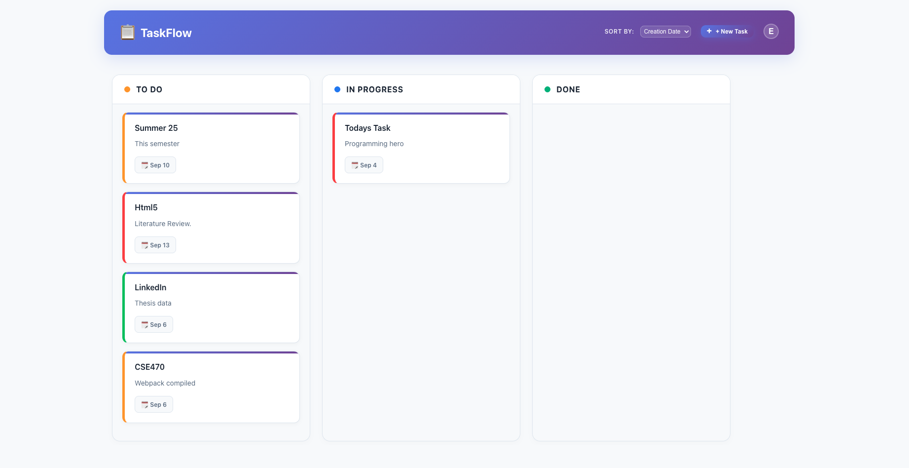
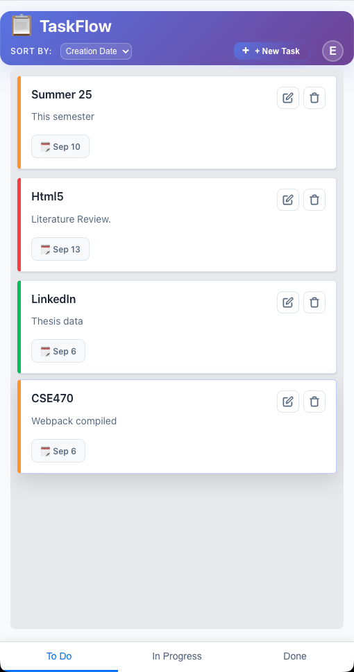

# TaskFlow - A Full-Stack Kanban Task Manager

A responsive, full-stack task management application built with the MERN stack (MongoDB, Express, React, Node.js). TaskFlow features a professional Kanban-style board, complete user authentication, and a modern, intuitive user interface designed to work seamlessly on both desktop and mobile devices.

**Live Demo:** [**https://shafis-task-flow.vercel.app/**](https://shafis-task-flow.vercel.app/)

---

## Screenshots

<table>
  <tr>
    <td align="center"><strong>Desktop View</strong></td>
    <td align="center"><strong>Mobile View</strong></td>
  </tr>
  <tr>
    <td></td>
    <td></td>
  </tr>
</table>

---

## Features

### Key Highlights
- **✅ Smart Task Management**: Create, edit, and organize tasks with priorities and deadlines.
- **📊 Interactive Kanban Board**: Drag-and-drop workflow to manage your "To Do", "Doing", and "Done" tasks effortlessly.
- **📈 Visual Statistics**: Gain insights into your productivity with interactive charts (Weekly trends, Priority breakdown) and detailed completion metrics.
- **⚙️ Modern Settings**: A fully responsive, mobile-friendly settings center to manage your Profile, Appearance (Dark/Light mode), and Notifications.
- **🎨 Premium Experience**: Beautiful Shadcn-inspired UI with smooth animations, ghost inputs, and a clean aesthetic.
- **📱 Mobile Optimized**: Seamless "Master-Detail" navigation on mobile devices and responsive layouts throughout.

### Core Functionality
- **User Authentication:** Secure user registration and login system using JWT (JSON Web Tokens) for session management.
- **CRUD for Tasks:** Full Create, Read, Update, and Delete functionality for tasks.
- **Kanban Board:** A three-column board ("To Do", "In Progress", "Done") to visually manage task workflow.
- **Drag & Drop:** Smoothly move tasks between columns to update their status.
- **Detailed Tasks:** Each task can include a title, description, priority level (High, Medium, Low), and a due date.
- **Sorting:** Easily sort tasks within columns by Creation Date, Due Date, or Priority.

### UI & UX
- **Fully Responsive:** The design seamlessly transforms from a three-column desktop view to a single-column, tab-bar-driven experience on mobile.
- **Modern Design:** A clean, professional interface with a consistent look and feel across all pages.
- **Interactive Modals:** All user actions (add, edit, delete confirmation) are handled through sleek, modern modal windows.
- **Professional Components:** Includes a user profile menu with an avatar and dropdown.
- **User Feedback:** Hover effects and other small details provide a responsive and engaging user experience.

### Backend & Security
- **Secure API:** The backend API is protected, ensuring users can only access and manage their own tasks.
- **Password Hashing:** User passwords are never stored in plain text, using `bcryptjs` for secure hashing.
- **CORS Configuration:** The server is configured to only accept requests from the deployed frontend application for enhanced security.

---

## Tech Stack

### Frontend
- **React:** A JavaScript library for building user interfaces.
- **React Router:** For client-side routing and navigation.
- **React Context API:** For global state management (user authentication).
- **@hello-pangea/dnd:** For drag-and-drop functionality.
- **React Icons:** For UI icons.
- **CSS:** Custom styling for a professional and responsive design.

### Backend
- **Node.js:** A JavaScript runtime environment.
- **Express:** A fast, unopinionated, minimalist web framework for Node.js.
- **MongoDB Atlas:** A fully-managed cloud database.
- **Mongoose:** An elegant MongoDB object modeling tool for Node.js.
- **JSON Web Tokens (JWT):** For secure user authorization.
- **bcryptjs:** For hashing passwords.

---

## Code Architecture

The project follows a standard **MERN** mono-repo structure, separating the frontend and backend concerns.

```
TaskFlow/
├── client/                 # Frontend React Application
│   ├── public/            # Static assets
│   └── src/
│       ├── api/           # Axios service layers for API communication
│       ├── components/    # Reusable UI components (TaskCard, KanbanBoard, etc.)
│       ├── context/       # React Context providers (Auth, Appearance)
│       ├── pages/         # Route implementations (TodoListPage, SettingsPage, etc.)
│       ├── types/         # TypeScript definitions
│       └── utils/         # Helper functions
│
├── backend/               # Backend Node.js/Express Application
│   ├── config/            # Database and App configuration
│   ├── controllers/       # Route logic and request handling
│   ├── middleware/        # Auth verification and error handling
│   ├── models/            # Mongoose Schemas (Task, User, Folder)
│   ├── routes/            # API endpoint definitions
│   └── server.js          # Entry point
│
└── README.md              # Project documentation
```

---

## Getting Started

To get a local copy up and running, follow these simple steps.

### Prerequisites
- Node.js installed on your machine
- npm
- A MongoDB Atlas account and connection string

### Installation & Setup

1.  **Clone the repository:**
    ```sh
    git clone https://github.com/mirza-shafi/TaskFlow.git
    ```

2.  **Install Backend Dependencies:**
    ```sh
    cd backend
    npm install
    ```

3.  **Create Backend Environment File:**
    - In the `backend` folder, create a file named `.env` and add your secret keys:
    ```env
    MONGO_URI=your_mongodb_connection_string
    JWT_SECRET=your_jwt_secret_string
    PORT=5001
    ```

4.  **Install Frontend Dependencies:**
    ```sh
    cd ../client
    npm install
    ```

### Running the Application

1.  **Start the Backend Server:**
    - In your `backend` terminal, run:
    ```sh
    npm run dev
    ```

2.  **Start the Frontend Development Server:**
    - In a **new** terminal, from the `client` folder, run:
    ```sh
    npm start
    ```
    - Your application should now be running at `http://localhost:3000`.

---

## Deployment

This project is configured for a two-part deployment:

- **Backend:** Deployed as a "Web Service" on **Render**, with the root directory set to `backend`.
- **Frontend:** Deployed as a "Project" on **Vercel**, with the root directory set to `client`.

Remember to set the appropriate environment variables in your hosting provider's dashboard and update the `cors` configuration in `server.js` with your live frontend URL.